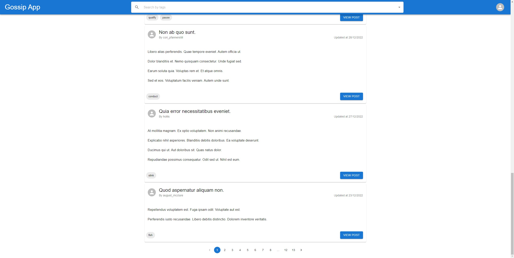
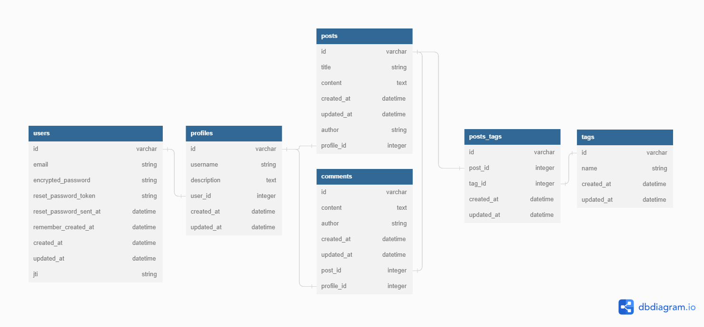

# Gossip-app
Gossip-app is a minimalistic forum made for the CVWO assignment.

## Features
- CRUD operations on posts and comments
- User authentication with JWT
- Searching of posts via tags
- User profile pages
- Pagination
- Input validation

## Showcase
.png)
.png)
.png)
.png)
.png)
.png)
.png)

### Write-up
The mid and final submission write-ups can be found in the write-up folder.
- [Mid-Submission: Execution plan and Use cases](main/write-up/TitusChewXuanJun_A0251687U.pdf)
- [Final-Submission: Accomplishments and User manual](main/write-up/TitusChewXuanJun_A0251687U_FinalWriteup.pdf)

### Technologies used
Frontend
 - React.js
    - axios
    - react query
    - moment
    - MUI
 - Typescript

Backend
- Ruby on Rails (as an API)
    - devise-jwt
    - faker
    - kaminari
- SQLite

## Final DB Schema

generated with https://dbdiagram.io/

## Set up
### Cloning this repository
Use `git clone --recursive https://github.com/tituschewxj/gossip-app.git` to clone this repository.

### Installing dependencies
The frontend uses yarn as it's package manager.

Use `yarn install` to install dependencies in the frontend.

Use `bundle install` to install dependencies in the backend.

### Running the application
1. Run backend server on port 3000: `rails s`
2. Run frontend server on port 3001: `yarn run start`

#### Login information for pre-generated fake users
- Default email: `${username}@email.com`
- Default password: `password`

## Submodules
This project has 2 submodules.
<!-- Update submodules with git submodule update --remote -->
1. `gossip-app-backend` contains the source code for the backend api.
2. `gossip-app-frontend` contains the source code for the frontend.

### Other details
- In `devise.rb`, the `jwt.expiration_time` is set to 30 minutes.
